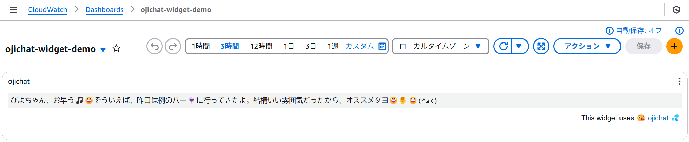

# cloudwatch-ojichat-widget

[ojichat](https://github.com/greymd/ojichat)を使ったシンプルなCloudWatch custom widgetです。  
[CloudWatch custom widget](https://docs.aws.amazon.com/AmazonCloudWatch/latest/monitoring/add_custom_widget_dashboard.html)のサンプルとしてお使いください。 

## 使い方

Lambda関数のデプロイで楽をしかったため[AWS Serverless Application Model(SAM)](https://aws.amazon.com/jp/serverless/sam/)を使っています。  
SAM CLIおよびGo言語の開発環境を整えたうえで`sam build`および`sam deploy`を使ってデプロイしてください。  

```bash
# samconfig.toml に必要な設定を記載済の前提
sam build && sam deploy
```

### ビルド環境

Go 1.23.0、SAM CLI 1.123.0の環境でビルドおよび動作確認しています。  

```powershell
PS C:\> go version
go version go1.23.0 windows/amd64
PS C:\> sam --version
SAM CLI, version 1.123.0
```

### デモ用ダッシュボード

CloudFormation Templateの`DoCreateDemoDashboard`パラメーターを`Yes`にするとデモ用ダッシュボードを作成します。  
とりあえず試したい場合はこのパラメーターを設定すると良いでしょう。  

```bash
# samconfig.toml に必要な設定を記載済の前提
sam build && sam deploy --parameter-overrides DoCreateDemoDashboard="Yes"
```

この場合`ojichat-widget-demo`という名前のダッシュボードが作成されます。



## Thanks

本ソフトウェアは以下を参考にしています。

* [greymd/ojichat](https://github.com/greymd/ojichat)
* [mokocm/serverless-ojichat](https://github.com/mokocm/serverless-ojichat)

## License

* [MIT](./LICENSE)
